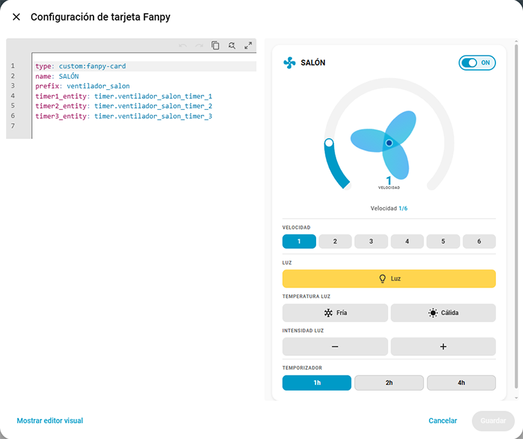

# Fanpy PRO


[](https://opensource.org/licenses/Apache-2.0)

[](https://github.com/hacs/integration)
[](https://github.com/figorr/fanpypro/actions/workflows/release.yml)


Custom integration for Home Assistant to configure ceiling fans for use with the [Fanpy Card](https://github.com/figorr/fanpy-card) Lovelace card.

## Purpose

Fanpy Pro is the **backend companion** for the Fanpy Card. While the card provides the frontend UI, this integration provides the configuration wizard and generates all the necessary entities and scripts.

## Features

- ✅ **Multi-step setup wizard** — area selection, mode choice, light/features toggles, gateway configuration
- ✅ **Two integration modes**: Remote (Gateway RF) and Direct (native `switch.*` / `light.*` entities)
- ✅ **Automatic entity creation** (Remote): `fan.*` (power + speed), `light.*` (light), `select.*` (speed selector + timer count)
- ✅ **Automatic entity creation** (Direct): `select.*` only (speed selector + timer count) — fan/light entities managed externally
- ✅ **State persistence** — entities restore their last state after HA restart (power, speed, light)
- ✅ **Timer support** — configurable number of timer buttons (0–3), exposed via a `select.fanpypro_<prefix>_num_timers` entity that the card reads at runtime. Timer entities are created manually with the native HA timer helper; the fan entity cancels active timers automatically when the fan turns off.
- ✅ **Multi-language support**: English, Spanish, Catalan
- ✅ **HACS compatible**

### Integration Modes vs Card Modes

| Mode | Description | Integration | Card entity selection | Card service calls |
|------|-------------|-------------|----------------------|-------------------|
| **Fanpy Remote** | Fanpy entities (`fan.fanpypro_*`, `light.fanpypro_*`, `select.fanpypro_*`) + auto-generated ESPHome RF scripts | Creates fan, light, select entities + Resync Luz button | Auto by prefix (`fanpypro_ventilador_{area}_*`) | Calls `fan.turn_on/off`, `fan.set_percentage`, `light.turn_on/off` natively; speed via `fan.set_percentage` |
| **Fanpy Direct** | Fanpy speed select (`select.fanpypro_*_velocidad`) + user's own `switch.*` / `light.*` (Shelly) | Creates only `select.fanpypro_*_velocidad` | Manual (`entity_fan`, `entity_light`) | Calls `switch.turn_on/off`, `light.turn_on/off` directly; speed via scripts |

The card also supports two manual modes (Helpers and Direct) that don't require the Fanpy integration — see the [card documentation](https://github.com/figorr/fanpy-card) for details.

## Installation

### HACS (Recommended) — Not available yet

1. Open HACS.
2. Search for **Fanpy** and install it.
3. Restart Home Assistant.

### HACS (Repository method)

Install using HACS before the integration is added to the default HACS repository.

1. Open HACS within Home Assistant.
2. Select the 3-dot button (top right) and then **Custom repositories**.
3. In the dialog that appears, enter:
   - **Repository**: Add the URL to the [repository](https://github.com/figorr/fanpypro) 
   - **Category**: Integration
4. Click **Add**.
5. Go to the **Search** tab of HACS and search for **Fanpy**.
6. Install it and restart Home Assistant.

### Manual

1. Download the `fanpypro.zip` from the latest release.
2. Unzip and copy `custom_components/fanpypro/` to your Home Assistant `custom_components` directory:
   ```
   /config/custom_components/fanpypro/
   ```
3. Restart Home Assistant.

## Usage

1. After restart, go to **Settings > Devices & Services > Add Integration**.
2. Search for **Fanpy** and select it.
3. Follow the wizard steps:

### Fanpy Remote (Gateway RF)

> **Requires**: ESPHome-based RF gateway (ESP32 + CC1101) with the [Daedilus dual-pin wiring](https://esphome.io/projects/daedilus.html) and a matching `gateway_{zone}_codes.yaml` file.

- **Step 1 -- Mode**: Select **Remote**
- **Step 2 -- Area**: Select the area where the fan is located and choose the fan number
- **Step 3 -- Speeds**: Set the number of speeds (1-10)
- **Step 4 -- Light**: Toggle whether the fan has a light
- **Step 5 -- Light Features** (if has light): Toggle color temperature and brightness controls
- **Step 6 -- Timer**: Select the number of timers (0-3)
- **Step 7 -- Gateway**: Select the RF gateway (e.g. **Salon**, **Cocina**, **Pasillo**). The dropdown is populated from files matching `gateway_*_codes.yaml` in the `fanpypro_codes/` directory.

This mode creates `fan.fanpypro_*`, `light.fanpypro_*`, `select.fanpypro_*` entities plus a **Resync Luz** button (only if the fan has light). Scripts are **auto-generated** by the integration into `{custom_components_dir}/fanpypro/generated/scripts.yaml` - no manual script creation needed. Use the card in **Fanpy Remote** mode.

### Fanpy Direct (Shelly switch.* / light.*)

- **Step 1 — Mode**: Select **Direct**
- **Step 2 — Area**: Select the area where the fan is located and choose the fan number
- **Step 3 — Fan & Speeds**: Select the existing `switch.*` entity (e.g. your Shelly relay) and set the number of speeds
- **Step 4 — Light**: Toggle whether the fan has a light
- **Step 5 — Light Entity** (if has light): Select the existing `light.*` entity
- **Step 6 — Light Features** (if has light): Toggle color temperature and brightness controls
- **Step 7 — Timer**: Select the number of timers (0–3). The card will show that many timer buttons and call native `timer.start`/`timer.cancel` on the timer entities you create manually with the HA timer helper.

This mode creates only `select.fanpypro_*_velocidad`. The card reads your Shelly entities directly. Use the card in **Fanpy Direct** mode.

### Gateway RF Codes Files

For the Gateway RF mode to work, you must have the corresponding codes files in:

```
{config_dir}/custom_components/fanpypro_codes/gateway_{zone}_codes.yaml
```

For example, if you select the **Salon** gateway, the integration looks for:

```
/config/custom_components/fanpypro_codes/gateway_salon_codes.yaml
```

These files contain the RC Switch codes captured from your physical remote. Without them:

- The **gateway dropdown** in the config flow will appear empty (no options to select)
- **scripts.yaml** will not be generated (auto-generation depends on code data)
- **RF event synchronization** will not work (the integration cannot match incoming RF codes to commands)

The integration itself will **not crash** on startup — it logs a warning and continues. But the fan will not respond to the physical remote and scripts will not be created.

> **Tip**: After capturing codes (e.g., via ESPHome logs), save them as `gateway_{zone}_codes.yaml` in the directory above before running the config flow. If you add a new gateway later, just create the corresponding file and restart HA.

### Card Configuration

After creating entities with the integration, add the card to your Lovelace dashboard:

```yaml
type: custom:fanpy-card
mode: fanpypro_remote        # or fanpypro_direct
prefix: ventilador_bodega  # auto-generated by the integration
name: BODEGA               # auto-generated by the integration
has_light: true
```

For **Fanpy Direct**, you must also specify the entity IDs:

```yaml
type: custom:fanpy-card
mode: fanpypro_direct
name: BODEGA
entity_fan: switch.shelly_relay_0
entity_light: light.shelly_rgb_1
has_light: true
```

### Required Scripts

For **Gateway RF** mode, scripts are **auto-generated** into `{custom_components_dir}/fanpypro/generated/scripts.yaml` every time Home Assistant starts or the integration reloads — no manual creation needed.

Make sure your `configuration.yaml` includes your scripts:

```yaml
script: !include scripts.yaml
```

The generated scripts call the ESPHome `transmit_rc_switch` service to send the RF command. Entity state updates are handled by the integration's Python code — scripts only send the RF command.

### How the flow works

When you press a button in the Fanpy Card:

#### Fanpy Remote mode (Gateway RF)

```
Card -> fan.set_percentage (service)
        -> FanpyProFanEntity updates HA state (is_on, percentage)
        -> Calls script.{prefix}_velocidad_{n} (RF via ESPHome)
        -> Updates select.fanpypro_{prefix}_velocidad to match
```

```
Card -> fan.turn_off (service)
        -> FanpyProFanEntity saves last speed, sets is_on=false
        -> Cancels active timers (Python)
        -> Calls script.{prefix}_power_off (RF via ESPHome)
```

#### Fanpy Direct mode

```
Card -> switch.turn_on/off (service, power)
Card -> light.turn_on/off (service, light)
Card -> script.{prefix}_velocidad_{n} (speed, RF via ESPHome)
```

The card calls `switch.*` / `light.*` entities directly. Speed scripts send the RF command — no entity updates are needed in scripts since the integration manages speed state via `select.fanpypro_{prefix}_velocidad`.

#### Physical remote to HA sync (Gateway RF only)

When you press the physical remote:

```
Remote button -> ESP32 gateway -> esphome.fanpypro_rf_code event
        -> FanpyProFanEntity.async_process_rf_command()
        -> Updates HA state (power, speed, light)
        -> Does NOT re-send RF (avoids echo)
```
### Entity Naming (Fanpy Remote mode)

Each entity is created with:
- **Friendly names**: `Fanpy {Name}`, `Fanpy {Name} Luz`, `Fanpy {Name} Velocidad`
- **Entity IDs**:
  - `fan.fanpypro_{prefix}` — fan power and speed (state: on/off, percentage)
  - `light.fanpypro_{prefix}_luz` — light power (state: on/off)
  - `select.fanpypro_{prefix}_velocidad` — speed selector (options: 1–N)
  - `select.fanpypro_{prefix}_num_timers` — number of timer buttons (set via config flow)

The `fanpypro_` prefix lets the card find related entities automatically.

## Reconfiguration

To change settings after initial setup:
1. Go to **Settings > Devices & Services**
2. Find the Fanpy integration entry
3. Remove and re-add it, selecting the new values

## Requirements

- Home Assistant 2025.12.5 or newer
- [Fanpy Card](https://github.com/figorr/fanpy-card) v3.0.0 or newer (for the Lovelace UI)
  - **The card**

    
  - **The editor**
  
    

    

## Development

```bash
git clone https://github.com/figorr/fanpypropro.git
cd fanpypro
```

## Translations

To add a new language:

1. Create `custom_components/fanpypro/translations/{lang}.json` with the same keys as `en.json`.
2. Submit a PR.

## License

Apache-2.0. See [LICENSE](LICENSE).
