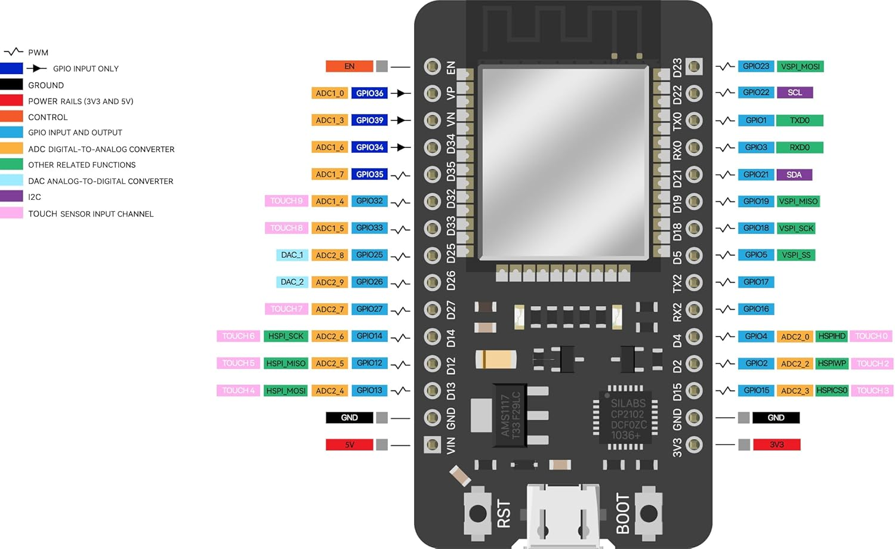
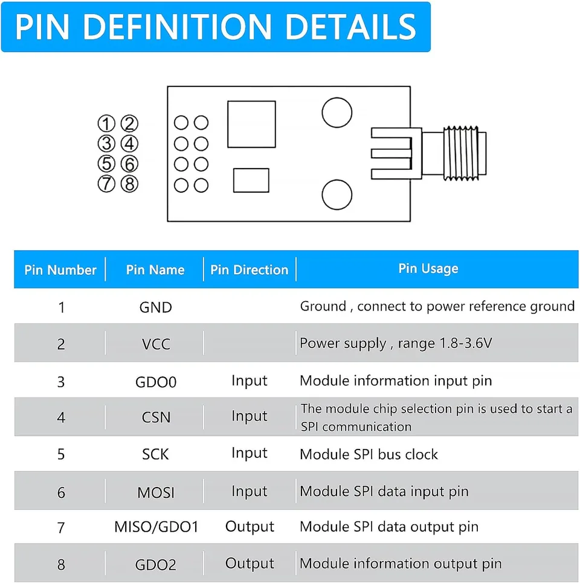
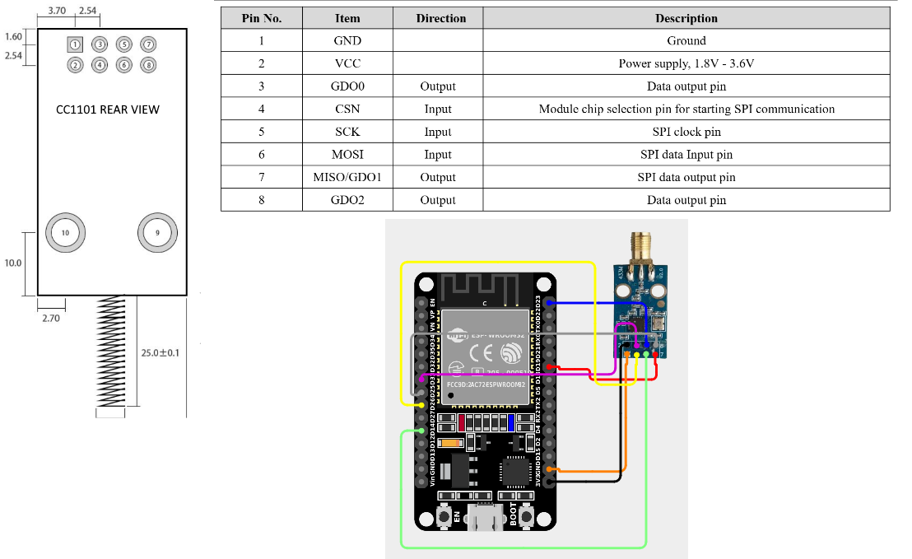
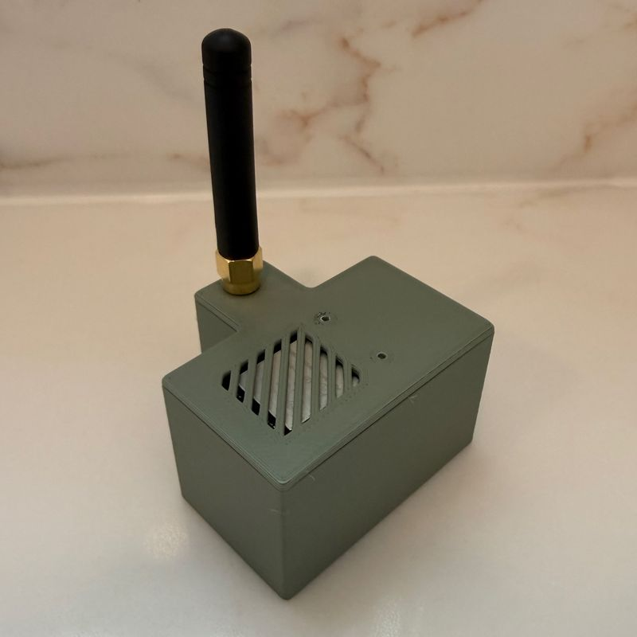

# Fanpy Pro Gateway — ESPHome

Multi-channel RF gateway using ESP32 NodeMCU + CC1101 for each room in the house.

## Variants

| File | Destination | IP | ESPHome Name |
|---|---|---|---|
| `gateway-salon.yaml` | Living room | `192.168.2.150` | `gateway_salon` |
| `gateway-cocina.yaml` | Kitchen | `192.168.2.151` | `gateway_cocina` |
| `gateway-pasillo.yaml` | Hallway | `192.168.2.152` | `gateway_pasillo` |

Each YAML file is self-contained and includes all configuration (WiFi, SPI, CC1101, API, OTA).

## Wiring

Connect each ESP32 NodeMCU pin to the CC1101 with female-to-female Dupont cables:

- **ESP32 pinout**

  

- **CC1101 pinout**

  

- **Wiring**

  

| ESP32 NodeMCU | CC1101 Pin | CC1101 | Cable color |
|---|---|---|---|
| GPIO26 | 3 | GDO0 (TX) | Yellow |
| GPIO25 | 8 | GDO2 (RX) | Gray |
| GPIO32 (CS) | 4 | CSN | Pink |
| GPIO14 (SCK) | 5 | SCK | Green |
| GPIO23 (MOSI) | 6 | MOSI | Blue |
| GPIO19 (MISO) | 7 | MISO | Red |
| 3.3V | 2 | VCC | Black |
| GND | 1 | GND | Orange |

> Based on the pinout from [Daedilus/cc1101-esp32-esphome-fan-controller](https://github.com/Daedilus/cc1101-esp32-esphome-fan-controller).

## Requirements

- ESP32 NodeMCU + CC1101 (8-pin v2.0 module)
- Female-to-female Dupont cables
- Home Assistant with ESPHome Builder 2026.5+
- ESP-IDF framework (configured in the YAMLs)

## Getting started

1. Fill in your secrets in `secrets.yaml` (WiFi, API key, OTA password).
2. Connect the wires according to the wiring table.
3. Flash the first device:

```bash
esphome run gateway-salon.yaml
```

4. From the ESPHome logs, press each button on the original remote. Look for lines like:

```
[I][remote.rc_switch:260]: Received RCSwitch Raw: protocol=1 data='11011101011010000001100110011'
```

5. With the captured codes, create a `gateway_salon_codes.yaml` file in `{config_dir}/custom_components/fanpypro_codes/` (use the [template](../custom_components/fanpypro/codes/gateway_template_codes.yaml)).
6. Repeat for kitchen and hallway with their respective YAMLs.

## API Services

### `transmit_rc_switch` (recommended)

Sends an RC Switch code using the detected protocol (protocol 1 for this remote):

```yaml
service: esphome.gateway_salon_transmit_rc_switch
data:
  code: "11011101011010000001100110011"
  repeat_times: 10
```

### `transmit_raw`

Sends a raw RF code (pulse array) — alternative method if RC Switch doesn't work:

```yaml
service: esphome.gateway_salon_transmit_raw
data:
  raw_code: [560, -620, 280, -310, ...]
  repeat_times: 10
  wait_time_ms: 0
```

## Events

When a physical remote button is pressed, the gateway fires the `esphome.fanpypro_rf_code` event:

```json
{
  "device": "gateway-salon",
  "code": "11011101011010000001100110011",
  "protocol": "1"
}
```

The fanpypro integration subscribes to this event to sync the fan state when the physical remote is used.

## Light sync (toggle)

If the physical remote uses the same code to turn the light on and off (toggle), desync can occur between the physical state and Home Assistant after a power outage, HA restart, or any uncontrolled event.

To fix it, the integration includes a **Resync Luz** button on each device (Settings → Devices & Services → your device → Controls). Pressing it:

- Toggles the light state in HA (just like the physical remote would)
- Does **not** send the RF signal to the fan

If the state doesn't correct on the first press, press again.

## Project files

| File | Purpose |
|---|---|
| `gateway-salon.yaml` | Living room gateway (IP: 192.168.2.150) |
| `gateway-cocina.yaml` | Kitchen gateway (IP: 192.168.2.151) |
| `gateway-pasillo.yaml` | Hallway gateway (IP: 192.168.2.152) |
| `secrets.yaml` | Credentials (do not commit to git) |
| `../custom_components/fanpypro/codes/gateway_template_codes.yaml` | Template for creating codes files |

## Case

If you need a case for the ESP32 and CC1101 you can print the case shared by @danoman at Printables:

[](https://www.printables.com/model/1736736-esp32-cc1101-case-usb-c-devkit)
